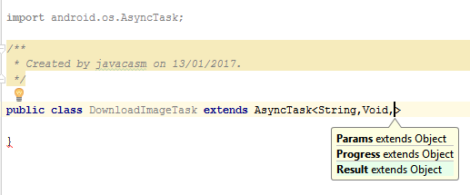

# hilos

En la terminología Android se suele llamar Subprocesos a los hilos

Algunas normas para su uso en Android
* No se debe bloquear el subproceso principal que es el que refresca el IU
* Otros hilos no pueden acceder a interface de usuario

Hay que tener en cuenta que no siempre es necesario usar un hilo para completar una tarea

Veremos cómo trabajar con hilos

### Ejemplo de carga lenta de contenidos

    public void onClick(View v) {
        new Thread(new Runnable() {
            public void run() {
                Bitmap b = loadImageFromNetwork("http://example.com/image.png");
                // mImageView.setImageBitmap(b);
                // No podemos acceder desde este elemento al IU
            }
        }).start();
    }

Se puede hacer así

    public void onClick(View v) {
        new Thread(new Runnable() {
            public void run() {
                final Bitmap bitmap =
                        loadImageFromNetwork("http://example.com/image.png");
                mImageView.post(new Runnable() {
                    public void run() {
                        mImageView.setImageBitmap(bitmap);
                    }
                });
            }
        }).start();
    }

Veamos un ejemplo completo

    private ProgressBar progress;
      private TextView text;

      @Override
      public void onCreate(Bundle savedInstanceState) {
        super.onCreate(savedInstanceState);
        setContentView(R.layout.main);
        progress = (ProgressBar) findViewById(R.id.progressBar1);
        text = (TextView) findViewById(R.id.textView1);

      }

      public void startProgress(View view) {
        Runnable runnable = new Runnable() {
          @Override
          public void run() {
            for (int i = 0; i <= 10; i++) {
              final int value = i;
               doFakeWork(); // Simula el trabajo pesado que estamos haciendo
              progress.post(new Runnable() {
                @Override
                public void run() {
                  text.setText("Actualizando");
                  progress.setProgress(value);
                }
              });
            }
          }
        };
        new Thread(runnable).start(); // Arrancamos el proceso en 2º plano
      }

      // Trabajo pesado
      private void doFakeWork() {
        try {
          Thread.sleep(2000);
        } catch (InterruptedException e) {
          e.printStackTrace();
        }
      }

    }

## AsynTask

Nos permite hacer un trabajo de forma asíncrona (sin esperar a que temine) y nos permite el acceso al IU

* Heredamos de AsynTask
* Implementamos el método pesado en doInBackground
* Accedemos al IU al terminar en onPostExecute
* Cada vez que llamemos a publisProgress se llama a onProgressUpdate
* Lo lanzamos desde el método Execute en el Subproceso principal

    public void onClick(View v) {
        new DownloadImageTask().execute("http://example.com/image.png");
    }

    private class DownloadImageTask extends AsyncTask<String, Void, Bitmap> {
        // The system calls this to perform work in a worker thread and
        //   delivers it the parameters given to AsyncTask.execute()
        protected Bitmap doInBackground(String... urls) {
            return loadImageFromNetwork(urls[0]);
        }

        // The system calls this to perform work in the UI thread and delivers
        //  the result from doInBackground()
        protected void onPostExecute(Bitmap result) {
            mImageView.setImageBitmap(result);
        }
    }

Los métodos onPreExecute, onPostExecute y onProgressUpdate se ejecutan en el subproceso de la IU

### Proceso

1. Creamos la clase que hereda de AsyncTask<Params,Progress,Result>

Se trata de una implementación que usa Generic, es decir, tenemos que especificar los tipos para nuestra implementación

1. Implementamos los métodos del interface

Y completamos el código

[Código completo](https://github.com/javacasm/AsyncTAsk)

## Referencias

[Tutorial de Android sobre procesos y Subprocesos](https://developer.android.com/guide/components/processes-and-threads.html?hl=es)

[Android Background Processinb by Vogella](http://www.vogella.com/tutorials/AndroidBackgroundProcessing/article.html)
